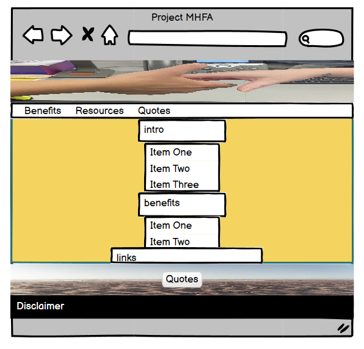
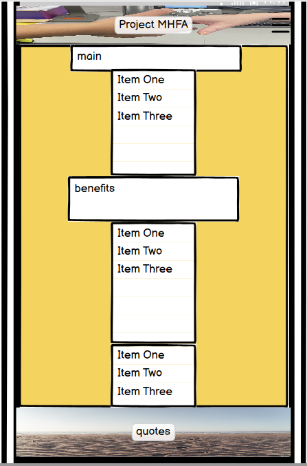

# Project MHFA

[View live project here on GitHub](Insert project URL)

Project MHFA is an organisation that recognises the need for Mental Health support within the workplace. The goal of the site is to show organisations the impact of Mental Health issues on produtivity and give some basic guidance on the benefits of providing in-house organisational support.

   
  

---

## CONTENTS  
  
* [UXD (User Experience Design)](#user-experience-ux)
  * [User Stories](#user-stories) 
* [Creation process (Strategy -> Surface)](#creation-process)
  * [Wireframes](#wireframes)
* [Design](#design)
  * [Colour Scheme](#color-scheme)
  * [Typography](#typography)
  * [Imagery](#imagery)
* [Page Features](#page-features)
  * [Navbar](#navbar)
  * [Hero-Image](#hero-image)
  * [Tagline & Call to Action](#tagline--call-to-action)
  * [Business Ethos](#business-ethos)
  * [Menu Page](#menu-page)
  * [Contact Page](#contact-page)
  * [Footer](#footer)  
* [Tablet & Mobile View](#tablet--mobile-view)
  * [Desktop, Tablet & Mobile Differences](#desktop-tablet--mobile-differences)
  * [Tablet View](#tablet-view-ipad-miniipad-prosurface-pro)
  * [Mobile View](#mobile-view-iphone-5iphone-seiphone-xriphone-12-pro)
* [Future Features](#future-features)
* [Technologies Used](#technologies-used)
  * [Languages Used](#languages-used)
  * [Frameworks, Libraries, Technologies & Programs Used](#frameworks-libraries-technologies--programs-used)
* [Deployment](#deployment)
  * [How to deploy](#how-to-deploy)
* [Testing](#testing)
  * [HTML Validation using W3C Validation](#html-validation-using-w3c-validation)
  * [CSS Validation using W3C Validation](#css-validation-using-w3c-validation)
  * [Lighthouse scores via Chrome Developer Tools](#lighthouse-scores-via-chrome-developer-tools)
  * [Bugs & Fixes](#bugs--fixes)
  * [Unsolved Bugs](#unsolved-bugs)
* [Credits](#credits) 

  
---    

## User Experience (UX)  
  
### **User Stories**  

### **Primary Goal**  
  
Project MHFA wants to set up a user friendly page that provides basic common Mental Health information alongside advocating for the deployment of Mental Health First Aiders within the workplace.

### **Visitor Goals** 

Mental Health illness can strike anybody at any time and visitors should have an overview of common sypmtoms and potential aids to alleviate those symptoms. Vistors should be under no illusion that the aids are a substitute for clinical advice but to be used as a support. Users should also be able to understand what the potential benefits are of having MHFA's within the workplace.

### **First Time Visitor**
  - A user can access each element of the site with one click via the navigation bar.
  - A user can find directions to access clinical advice via the footer.
  - A user can find supporting links to the content through the resource section.

### **Returning Visitor**  
  - A user can find inspiration from the quote section.
  
### **Frequent Visitor**  
  - 

--- 

## Creation Process  
  
### **1. Strategy**  

- I required an easy-to-read, dependable website that delivers clear information about common symptoms of Mental Health issues and relevant aids.  
- Links to further resources and urgent care should be available.  
- The site must have a warming and calming palette.   
- Mobile responsiveness is an essential feature required for this website.
  

### **2. Scope**  

The Project MHFA site must be available on a wide range of devices due to the varied range of potential users. The user base is huge in scope given that it should provide support to those who live with Mental Health issues, and provide advocacy support for thos who want to introduce the project into the workplace. 

- The site is to contain only basic information. It is not intended to replace clinical advice.  
- Text must be clear and legible on any sized device to allow the user instant access to the aids and further resources.  
- A brief supporting passage for MHFA advocacy should be present on the landing page  
- For future development, a contact system should be put in place to allow for organisations to reach out on information to develop in-house MHFA deployment.
  

### **3. Structural**  

Similar to the idea for the design and layout to be accessible and functional, simple navigation and interactivity were essential. The site needed to provide information swiftly no matter the age of the user.  
- Easy to identify, clickable links with a consistent layout. The design was to be predictable in line with current trends. 
- Any buttons or links had to provide feedback to the user to identify their purpose in the form of a design change that followed the flow of the overall aesthetic.   

  
### **4. Skeleton**  

The site was developed to be simple, clear, and familiar.  

- For the landing page, the header and supporting image is to be at the top and fill the width of the page, no matter the orientation or screen size.  
- There will be a simple three-item navigation bar of 'Home', 'Aids', and 'References'.
- A large, clear image dominates the landing page with a close-up view of two hands coming together.  
- The image will be supported by a inspiring quote.
- The page ends with the footer, with the declaration in regards to seeking actual clinical advice.
- The page will contain two lists, symptoms first and aids second.
- The page will contain resource links towards the foot of the page followed by inspiring quotes. 

### Wireframes  

Wireframe - Homepage Desktop
  

 

Wireframe - Homepage Mobile
  

 

### **5. Surface**  

 A design was created that allowed a consistent flow throughout the site.   
 - A background color was implemented to add a calm atmosphere and allow for content to be easily viewed.  
 - A palette of soft green's, blue's, and yellow's was used to help the user identify with nature.  

Overall, the design was intended to show that support is available without adding to any further distress a user may be experiencing.  
 
---   
  
  
## Design  

### **Color Scheme**  

  
### **Typography**  
  Looked to kepp typography in line with NHS fonts. NHS uses a font called frutiger. Nearest available on google fonts was Istok-Web

        
### **Imagery**  
  Scope was to use calming images. Central background is a pastel image that opens into a sunset on larger screens and whilst visually different on various screens adds a pleaseing aspect. At the head of the page I wanted to try and focus on the idea that of people being given help in the workplace. The final in the quotes section is of a dog in the Scottish Highlands. This section sits directly under the aids to alleviate issues section and has been used in an attempt to underline the idea of being out in nature and also pet therapy.

---  
  

## Page Features  

### **Navbar**   

  

 

   

  

 

  
### **Menu Page** 

 

  

 

### **Contact Page**  

 
 
  

 

### **Footer**  

---   

## Tablet & Mobile View  
 
### **Desktop, Tablet & Mobile Differences**  
  

  
### **Tablet View (iPad Mini/iPad Pro/Surface Pro)**  
  

### **Mobile View (iPhone 5/iPhone SE/iPhone XR/iPhone 12 Pro)**  
  

---  
                              

## Future Features  

- For future development, I would like to add a call to action button that would deploy a modal linking users to relevant emergency suport services.  
- Develop further pages to contain relevant helpful links to a greater library of external resources with a brief summary of those resources.
- A gallery page of inspirational images and quotes designed to empower the user.
  
---   
  

## Technologies Used    

### **Languages Used**   

- HTML5
- CSS3

### **Frameworks, Libraries, Technologies & Programs Used**  

## Deployment

### **How to deploy**  

---  
    

## Testing  

### **Initial testing plan**

  
### **Testing**    

 
### **HTML Validation using W3C Validation**  

   

### **CSS Validation using W3C Validation** 

   

### **Lighthouse scores via Chrome Developer Tools**   
  
  
### **Bugs & Fixes**  
  Initial issues with brand image in the head of the site. Image would not maintain integrity as a background image set in CSS. Set up as an image in HTML but needs further work in relation to sizing when viewing on different screen sizes.

### **Unsolved Bugs** 

## Credits  
  
### **Content References**
- [World Health Organisation](https://www.who.int/news-room/fact-sheets/detail/mental-health-at-work) for information relating to numbers affected by Mental Health issues and statistics on days lost.
- [Code Institute](https://codeinstitute.net/ie/) for their HTML/CSS learning material.
- [MHFA England](https://mhfaengland.org/mhfa-centre/blog/impact-of-MHFA/#:~:text=Since%20its%20inception%2C%20there%20have,to%20support%20themselves%20or%20others) for information on the benefits of using MHFA's in the workplace.
- [Mayo clinic](https://www.mayoclinic.org/diseases-conditions/mental-illness/symptoms-causes/syc-20374968) for common symptoms of Mental Health illness.
- [Piedmont](https://www.piedmont.org/living-real-change/10-ways-to-fight-depression-%E2%80%93-naturally) for providing natural remedies to common symptoms of Mental Health illness.
- J.K Rowling - "The prisoner of Azkaban" for providing the Albus Dumbledore quote.
- [NHS England](https://www.nhs.uk) for clarification on action to be taken in an emergency and for identifying font used acroos NHS websites.
- [7 Summit Pathways](https://7summitpathways.com/blog/15-positive-mental-health-quotes/) for providing inspirational quotes.

### **Media References**  
  - [Pexels](https://www.pexels.com/) for photograps used on this site, credit to Ben Mack.
  - [Google fonts](https://fonts.google.com/) for font used on the site.
  - [Font awesome](https://fontawesome.com/) for icons used on the site.
  - [pixabay](https://pixabay.com/) for quotes background image, credit to larisa Periman.

### **Acknowledgements** 
- I would like to acknowledge my Code Institute learning facilitator, Amy Richardson, and my Code Institute SME, Kevin Loughrey, for the support and guidance in the build up and during the development of this project.
- The Lancs 2024 BC cohort who have been an inspration in providing support and solidarity.
- My family for testing my work and helping to create images for the project
