# Project MHFA

[View live project here on GitHub](https://heath1979.github.io/ci-project-one-mental-health-awareness/)

Project MHFA is an organisation that recognises the need for Mental Health support within the workplace. The goal of the site is to show organisations the impact of Mental Health issues on produtivity and give some basic guidance on the benefits of providing in-house organisational support.

   
  
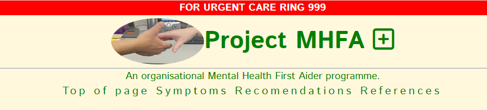

---

## CONTENTS  
  
* [UXD (User Experience Design)](#user-experience-ux)
  * [User Stories](#user-stories) 
* [Creation process (Strategy -> Surface)](#creation-process)
  * [Wireframes](#wireframes)
* [Design](#design)
  * [Colour Scheme](#color-scheme)
  * [Typography](#typography)
  * [Imagery](#imagery)
* [Page Features](#page-features)
  * [Navbar](#navbar)
  * [brand-Image](#brand-image)
  * [Footer](#footer)  
* [Tablet & Mobile View](#tablet--mobile-view)
  * [Desktop, Tablet & Mobile Differences](#desktop-tablet--mobile-differences)
  * [Mobile View](#mobile-view-iphonese)
  * [Laptop View](#laptop-view-msi-modern-15-h-b13m)
* [Future Features](#future-features)
* [Technologies Used](#technologies-used)
  * [Languages Used](#languages-used)
  * [Frameworks, Libraries, Technologies & Programs Used](#frameworks-libraries-technologies--programs-used)
* [Deployment](#deployment)
  * [How to deploy](#how-to-deploy)
* [Testing](#testing)
  * [HTML Validation using W3C Validation](#html-validation-using-w3c-validation)
  * [CSS Validation using W3C Validation](#css-validation-using-w3c-validation)
  * [Lighthouse scores via Chrome Developer Tools](#lighthouse-scores-via-chrome-developer-tools)
  * [Bugs & Fixes](#bugs--fixes)
  * [Unsolved Bugs](#unsolved-bugs)
* [Credits](#credits) 

  
---    

## User Experience (UX)  
  
### **User Stories**  

### **Primary Goal**  
  
Project MHFA wants to set up a user friendly page that provides basic common Mental Health information alongside advocating for the deployment of Mental Health First Aiders within the workplace.

### **Visitor Goals** 

Mental Health illness can strike anybody at any time and visitors should have an overview of common sypmtoms and potential aids to alleviate those symptoms. Vistors should be under no illusion that the aids are a substitute for clinical advice but to be used as a support. Users should also be able to understand what the potential benefits are of having MHFA's within the workplace.

### **First Time Visitor**

  - A user can access each element of the site with one click via the navigation bar.
  - A user can find directions to access clinical advice via the footer.
  - A user can find supporting links to the content through the resource section.

### **Returning Visitor**  

  - A user can find inspiration from the quote section.
  
--- 

## Creation Process  
  
### **1. Strategy**  

- I required an easy-to-read, dependable website that delivers clear information about common symptoms of Mental Health issues and relevant aids.  
- Links to further resources and urgent care should be available.  
- The site must have a warming and calming palette.   
- Mobile responsiveness is an essential feature required for this website.
  
### **2. Scope**  

The Project MHFA site must be available on a wide range of devices due to the varied range of potential users. The user base is huge in scope given that it should provide support to those who live with Mental Health issues, and provide advocacy support for thos who want to introduce the project into the workplace. 

- The site is to contain only basic information. It is not intended to replace clinical advice.  
- Text must be clear and legible on any sized device to allow the user instant access to the aids and further resources.  
- A brief supporting passage for MHFA advocacy should be present on the landing page  
- For future development, a contact system should be put in place to allow for organisations to reach out on information to develop in-house MHFA deployment.
  
### **3. Structural**  

Similar to the idea for the design and layout to be accessible and functional, simple navigation and interactivity were essential. The site needed to provide information swiftly no matter the age of the user.  
- Easy to identify, clickable links with a consistent layout. The design was to be predictable in line with current trends. 
- Any buttons or links had to provide feedback to the user to identify their purpose in the form of a design change that followed the flow of the overall aesthetic.   

### **4. Skeleton**  

The site was developed to be simple, clear, and familiar.  

- For the landing page, the header and supporting image is to be at the top and fill the width of the page, no matter the orientation or screen size.  
- There will be a simple three-item navigation bar of 'Home', 'Aids', and 'References'.
- A large, clear image dominates the landing page with a close-up view of two hands coming together.  
- The image will be supported by a inspiring quote.
- The page ends with the footer, with the declaration in regards to seeking actual clinical advice.
- The page will contain two lists, symptoms first and aids second.
- The page will contain resource links towards the foot of the page followed by inspiring quotes. 

### Wireframes  

Wireframe - Homepage Desktop
  

 

Wireframe - Homepage Mobile
  

 

### **5. Surface**  

 A design was created that allowed a consistent flow throughout the site.   
 - A background color was implemented to add a calm atmosphere and allow for content to be easily viewed.  
 - A palette of soft green's, blue's, and yellow's was used to help the user identify with nature.  

Overall, the design was intended to show that support is available without adding to any further distress a user may be experiencing.  
 
---   
  
## Design  

### **Color Scheme**  

The website uses a pallette of pastels in line with the brief that the site should have a caliming effect. The corn silk was intended to be the main background focus initially as outlined in the wireframe but worked better visibily as a background for the header and the footer and contrasted nicely with the background image in the main content section.
  
### **Typography**  

  [Google Fonts](https://fonts.google.com/) was used to import the Istok-web font used throughout the site. This is a clinical and clean font that aligns with the font of Frutiger that is used on NHS websites.

  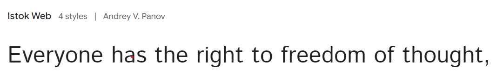
        
### **Imagery**  

  Scope was to use calming images. Central background is a pastel image that opens into a sunset on larger screens and whilst visually different on various screens adds a pleaseing aspect. At the head of the page I wanted to try and focus on the idea that of people being given help in the workplace.

---  

## Page Features  

### **Navbar**   

  

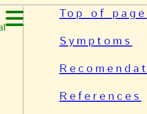 
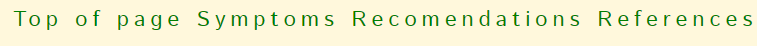 

Navbar opens in mobile view, but displayed in larger screen sizes at the bottom center of the header.

   

### **Brand Image**  

  

 
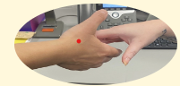  

Brand image set in a circle shape on mobile and opens to a oval in larger screensizes.

  

### **Footer**  

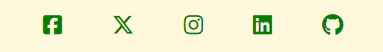

The footer contains clickable links to social media sites and is consistent across all screen sizes.

---   

## Tablet & Mobile View  
 
### **Desktop, Tablet & Mobile Differences**  
  
To ensure responsivity I used flexbox in my CSS styling. content is aligned to the left o the page on mobile devices but moves centrally on larger screen sizes.
  

### **Mobile View (iPhone SE)**  
  
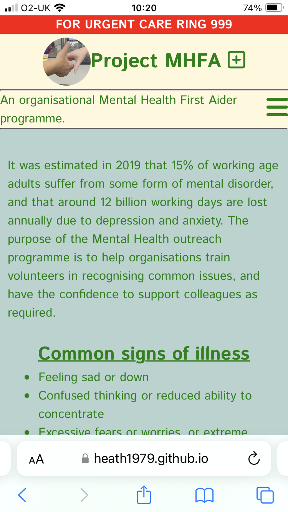

### **laptop view (MSI Modern 15 H B13M)**  
  
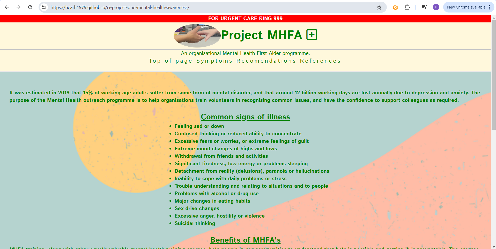

---  
                              

## Future Features  

- For future development, I would like to add a call to action button that would deploy a modal linking users to relevant emergency suport services.  
- Develop further pages to contain relevant helpful links to a greater library of external resources with a brief summary of those resources.
- A gallery page of inspirational images and quotes designed to empower the user.
  
---   
  
## Technologies Used    

### **Languages Used**   

- HTML5
- CSS3

### **Frameworks, Libraries, Technologies & Programs Used**  

- Balsamiq - used to create wireframes and edit images 
- GitHub - used to save and store all files for this website  
- Git - used for version control
- Google Fonts - fonts were imported from here 
- Font Awesome - icons and their associated kit were downloaded from here  
- Google Dev Tools - to debug and for testing responsiveness 
- Google Lighthouse - for auditing the website
- W3C Validator - for validating the HTML and CSS code 
- Convertio - to compress images 
- Favicon.io - for MHFA favicon  

## Deployment

### **How to deploy**  

GitHub was used to deploy the website. These were the steps taken to acheive this:  

1. Login to GitHub account
2. Navigate to the project repository, scoops_pp1
3. Click the Settings button near the top of the page
4. In the left-hand menu, find and click on the Pages button
5. In the Source section, choose 'main' from the drop-down, select branch menu
6. Select 'root' from the drop-down folder menu
7. Click 'Save' and after a few moments the project will have been made live and a link is visible at the top of the page

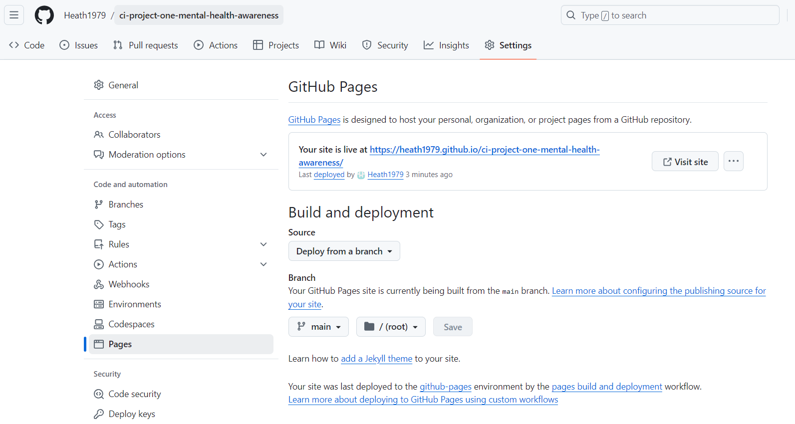 

---  
    
## Testing  

### **Initial testing plan**

  I had planned for this site to be accessible and legible on all screen sizes. The user is viewing the site primarily to understand the role of MHFA in the workplace and to understand potential symptoms and aids to mental health illness. I used Chrome Dev Tools to test, tweak and debug in the early stages. I deployed my site halfway through to test on real-world devices. These devices included:  
- MSI laptop 15.6"  
- iphone SE

### **Testing**    

Testing took place throughout the entire build using Dev Tools on Chrome and on the above real-world devices. The browsers used were:  
- Chrome   
- Edge  
- Safari  
 
The results of feature testing are as follows:  
  
| Page | Test | Pass/Fail |
| :----| :----| :--------:|
| All  | Underline appears under the references links when the mouse hovers in Chrome| Pass |
| All  | Underline appears under the references links when the mouse hovers in Edge| Fail |
| All  | Navigation links bring the user to relevant section of the page | Pass |
| All  | Footer social media icons bring the user to relevant sites via a new tab | Pass |
| All  | Sections are responsive in different media sizes | Pass |

### **HTML Validation using W3C Validation**  

Index page HTML validation
  

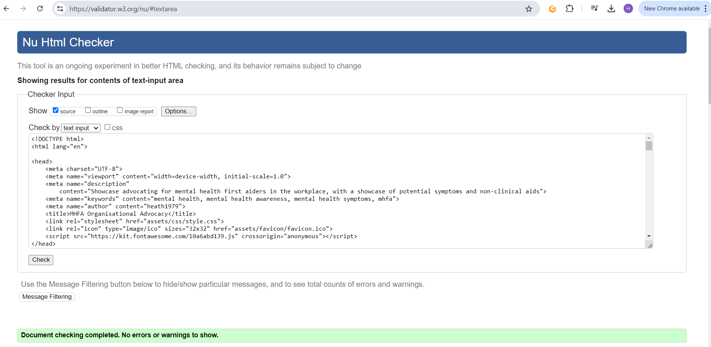

   

   

### **CSS Validation using W3C Validation** 

MHFA CSS validation
  

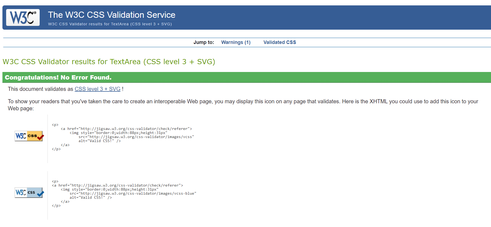

   

   

### **Lighthouse scores via Chrome Developer Tools**   

For Desktop   

Lighthouse audit for Index page
  

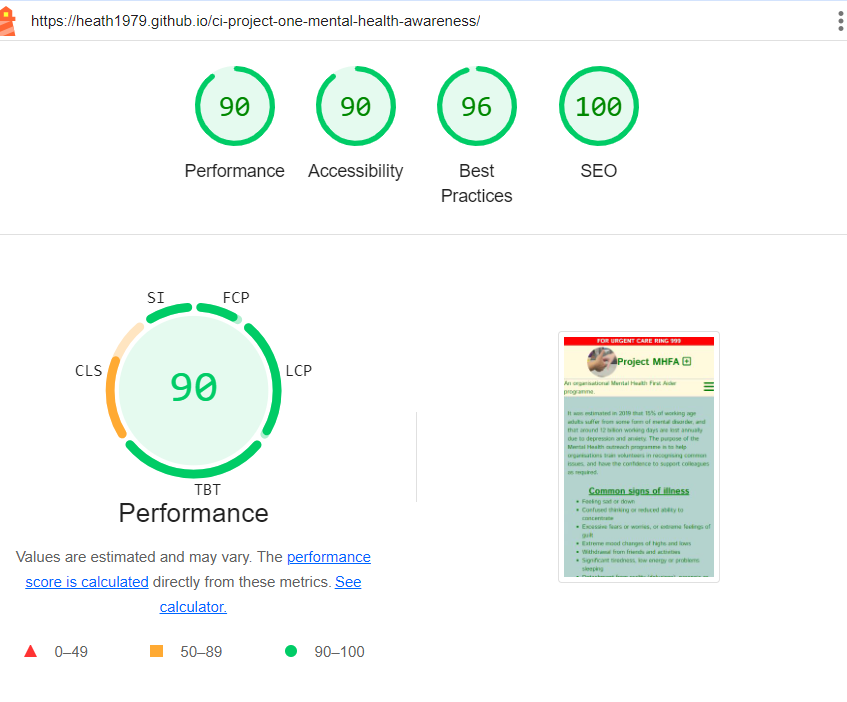

 

  
### **Bugs & Fixes**  

| Bug | Section | Fix |
| :----| :----| :--------:|
| Brand immage would not size correctly at different sizes | Header | Amended to a image in HTML and sat alongside site heading |
| Default margin around the page looked unsightly | All page | Used wildcard selector to override browser defaults |
| Navbar opened selection menu in the center of the page | Header | Changed position to relative instead of fixed |
| List elements not aligning correctly when moved centrally at larger screen sizes | Main | Contained list elements within a div to move centrally and then align the contents to the left |
| Disc symbols on lists disappeared when adding wildcard styling to CSS | Main | Removed padding from wildcard selector |
| Navigation elements would not center on larger screen sizes | Header | Temporary fix using absolute margin-left value. Needs further investigation into flexbox in order to align content centrally |  

### **Unsolved Bugs** 

- Navigation elements will not align correctly without the use of absolute styling. Further invetigation is required on the flexbox properties.
- Navigation bar opens to the left in mobile instead of underneath. Probably that the whole brand-nav-statement section needs a re-build.
- Hover pseudo prperty does not work on the navigation aspects in the nav bar. Suspect related to other Nav bar issues.
- Hoped to add HR breaks bewteen the quotes to underline 75% of the quote. Styling on these affected the HR lines in the header.
- Background image set in style.css is not responsive. 

## Credits  
  
### **Content References**
All content written for the website has been sourced from other sites (as linked below). The user should be aware that the author has had no input from a clinical panel in relation to the symptoms of mental health illness and potential aids to this kind of condition.
- [World Health Organisation](https://www.who.int/news-room/fact-sheets/detail/mental-health-at-work) for information relating to numbers affected by Mental Health issues and statistics on days lost.
- [Code Institute](https://codeinstitute.net/ie/) for their HTML/CSS learning material and nav bar information in the "Love Running" project.
- [MHFA England](https://mhfaengland.org/mhfa-centre/blog/impact-of-MHFA/#:~:text=Since%20its%20inception%2C%20there%20have,to%20support%20themselves%20or%20others) for information on the benefits of using MHFA's in the workplace.
- [Mayo clinic](https://www.mayoclinic.org/diseases-conditions/mental-illness/symptoms-causes/syc-20374968) for common symptoms of Mental Health illness.
- [Piedmont](https://www.piedmont.org/living-real-change/10-ways-to-fight-depression-%E2%80%93-naturally) for providing natural remedies to common symptoms of Mental Health illness.
- J.K Rowling - "The prisoner of Azkaban" for providing the Albus Dumbledore quote.
- [NHS England](https://www.nhs.uk) for clarification on action to be taken in an emergency and for identifying font used acroos NHS websites.
- [7 Summit Pathways](https://7summitpathways.com/blog/15-positive-mental-health-quotes/) for providing inspirational quotes.

### **Media References**  
  - [Pexels](https://www.pexels.com/) for photograps used on this site, credit to Ben Mack.
  - [Google fonts](https://fonts.google.com/) for font used on the site.
  - [Font awesome](https://fontawesome.com/) for icons used on the site.
  - [pixabay](https://pixabay.com/) for quotes background image, credit to larisa Periman.
  - [Favicon](https://favicon.io/) for the favicon used for this site.

### **Acknowledgements** 
- I would like to acknowledge my Code Institute learning facilitator, Amy Richardson, and my Code Institute SME, Kevin Loughrey, for the support and guidance in the build up and during the development of this project.
- The Lancs 2024 BC cohort who have been an inspration in providing support and solidarity.
- My family for testing my work and helping to create images for the project.
